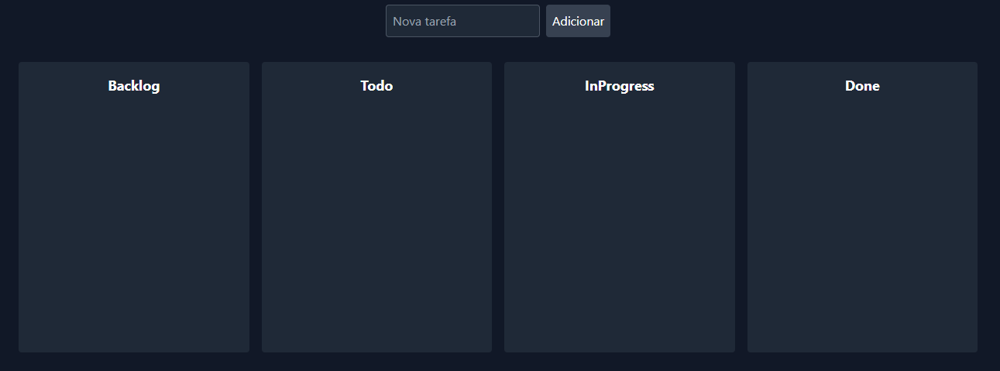

Trello Clone

Este é um clone básico do Trello construído com React e Tailwind CSS. O objetivo deste projeto é fornecer uma interface de usuário interativa e responsiva para gerenciar tarefas em um formato de board, com funcionalidades de drag-and-drop entre colunas.

Funcionalidades

Adicionar Tarefas: Insira novas tarefas no board.
Drag-and-Drop: Arraste tarefas entre colunas diferentes (Backlog, Todo, In Progress, Done).
Editar e Excluir Tarefas: Edite o texto e exclua tarefas existentes.
Persistência de Dados: Os dados das tarefas são salvos no localStorage, garantindo que as tarefas permaneçam após recarregar a página.
Interface Responsiva: Layout ajustável para diferentes tamanhos de tela.

Tecnologias Utilizadas

React: Biblioteca JavaScript para construir interfaces de usuário.
Tailwind CSS: Framework CSS para estilização.
@hello-pangea/dnd: Biblioteca para funcionalidade de drag-and-drop.

Como Executar o Projeto

git clone
npm install
npm run dev

